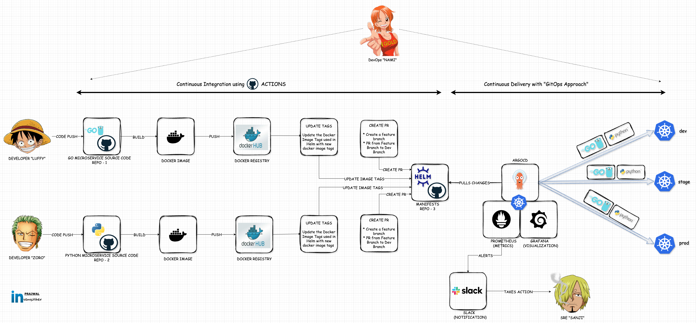

<!-- START doctoc generated TOC please keep comment here to allow auto update -->
<!-- DON'T EDIT THIS SECTION, INSTEAD RE-RUN doctoc TO UPDATE -->
**Table of Contents**

- [Crisp DevOps](#crisp-devops)

<!-- END doctoc generated TOC please keep comment here to allow auto update -->

# Crisp DevOps

This project covers everything about DevOps

1) Microservices 
2) Docker
3) CI-CD - GitHub Actions
3) Kubernetes - Kustomize, Helm 
4) Observability - Prometheus & Grafana, EFK stack, Jaeger 
5) GitOps - ArgoCD

# Architecture Diagarm 

<!--doc_begin-->
<!--doc_end-->